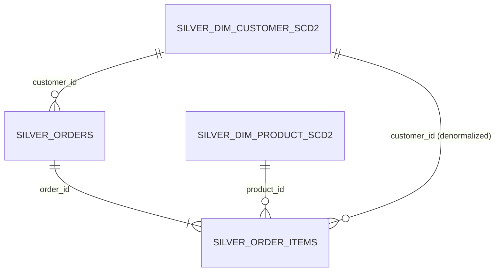
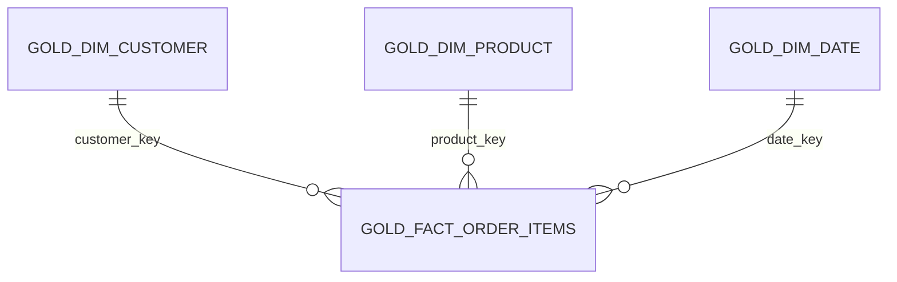

# order-lakehouse

A single Lakeflow Declarative Pipeline for an order/order-item data model,
built as a Databricks Asset Bundle (DAB) and designed to deploy on
**Databricks Free Edition**.

Customers place orders. Each order has one or more line items (product,
quantity, status). An order is `Completed` once every item on it has been
delivered — item-level status is the source of truth; order-level status is
always derived from it, never set directly.

**Order events are streamed** (Auto Loader → `dlt.apply_changes`, SCD Type
1). **Customer and product dimensions are CDC-driven** (their own change
stream → `dlt.apply_changes`, SCD Type 2, full version history). Same AUTO
CDC primitive, two different history-keeping modes, chosen for what's
actually being modeled — see [Architecture](#architecture) below.

## Entity-relationship model

See [`docs/er-diagram.md`](docs/er-diagram.md) for the full conceptual /
logical / physical progression:

- **Conceptual** — entities and relationships only, no attributes.
- **Logical** — every attribute, primary/foreign keys, generic
  (technology-independent) types.
- **Physical** — exact deployed table/column names and Delta types, split
  into the snowflake-shaped silver layer and the star-schema gold layer.

Summary:

- `Customer 1—N Order`, `Order 1—N OrderItem`, `Product 1—N OrderItem`
- `Order.order_status` is a rollup of its `OrderItem.item_status` values,
  never set directly
- Silver is snowflake-shaped (normalized, multi-hop joins) — the
  conformance layer. Gold is star-shaped (denormalized, single-hop joins) —
  the consumption layer.



*Silver — snowflake, multi-hop. Gold — star, single-hop:*



## Architecture

```
 synthetic OMS                bronze                    silver                       gold
 (generate_synthetic_orders)  Auto Loader,               apply_changes (SCD1)         star schema,
 -> order_events/             append-only Delta          dedup + status rollup        materialized on
                        --------------->             --------------->              each pipeline run
                                                                              --------------->
 synthetic CDC feed           bronze                    silver                       gold_fact_order_items
 (generate_dimension_         Auto Loader,               apply_changes (SCD2)         gold_monthly_product_sales
  cdc_events)                 append-only Delta          full version history         gold_dim_customer / _product / _date
 -> customer_changes/,
    product_changes/
```

| Layer | What it does | Why |
|---|---|---|
| **Bronze** | Auto Loader streams JSON events out of a Unity Catalog Volume into append-only Delta tables — one for order events, one each for customer/product CDC. No transformation. | Cheap, replayable audit trail. |
| **Silver: order items** | `dlt.apply_changes`, `stored_as_scd_type=1` — dedups by `order_item_id`, keeps latest status only. `silver_orders` then rolls item statuses up to order-level status. | Current fulfillment state is all that's needed; no history to keep. |
| **Silver: dimensions** | `dlt.apply_changes`, `stored_as_scd_type=2` — full version history per customer/product, with `__START_AT`/`__END_AT` managed automatically. | Dimension state (a customer's region, a product's price) is exactly what point-in-time reporting needs to see as of a point in time, not as it stands today. |
| **Gold** | Star schema: `gold_fact_order_items` at item grain, joined by a single hop to `gold_dim_customer`, `gold_dim_product` (current-state projections of the SCD2 tables), and a conformed `gold_dim_date`. | Analysts and BI tools query this directly — fewer, cheaper joins matter more here than storage normalization. |

### Data quality expectations

Three severities, used where each actually fits the failure mode:

| Expectation | Severity | Why |
|---|---|---|
| `valid_order_item_id`, `valid_product_id`, `valid_quantity`, `valid_item_status` | `expect_or_drop` | Structurally corrupt order-item rows — drop silently, don't halt the pipeline over upstream noise. |
| `valid_customer_id`, `valid_operation`, `valid_list_price` (dimension CDC events) | `expect_or_drop` | Same reasoning, applied to the CDC streams — a change event with no key or an unrecognized `operation` can't be applied. |
| `has_event_time`, `has_change_time` | `expect` (warn only) | A missing timestamp is a completeness gap worth tracking, but the row is still usable — `apply_changes` just can't sequence it precisely. |
| `rollup_consistency` (`delivered_item_count <= item_count`) | `expect_or_fail` | A hard invariant — if this is ever false, the aggregation logic itself is broken and the pipeline should stop. |
| `non_negative_units` | `expect_or_fail` | Same reasoning — a negative unit count can only mean an aggregation bug. |

### Why Free Edition changes the design

Databricks Free Edition is **serverless-only** — one workspace, one
metastore, no cluster configuration, and no self-hosted Kafka/Event Hubs to
attach as a real streaming or CDC source. Two adaptations follow from that:

1. **No cluster specs anywhere in this bundle.** Lakeflow Declarative
   Pipelines run serverless by default, which is required (and the only
   option) on Free Edition.
2. **Synthetic generators stand in for real upstream systems.**
   `generate_synthetic_orders.py` plays the role of an OMS;
   `generate_dimension_cdc_events.py` plays the role of a CDC connector
   (Debezium, a native DB CDC feed) in front of a customer-profile service
   and a product catalog. Both write JSON into the same landing volume, in
   separate subfolders, exactly the shape a real source would produce —
   swap either out for a real source and nothing downstream needs to
   change.

## Project structure

```
order-lakehouse/
├── databricks.yml                  # DAB root config (bundle, variables, targets)
├── resources/
│   ├── jobs.yml                    # setup_job + the two synthetic event generators
│   └── pipelines.yml               # order_pipeline (the Lakeflow Declarative Pipeline)
├── src/
│   ├── 00_setup/
│   │   └── create_catalog_schema.py    # Catalog/schema/volume only (idempotent)
│   ├── data_generator/
│   │   ├── generate_synthetic_orders.py       # Synthetic OMS event producer
│   │   └── generate_dimension_cdc_events.py   # Synthetic CDC event producer
│   ├── pipeline/
│   │   └── order_pipeline_dlt.py       # Full bronze -> silver -> gold pipeline
│   └── queries/
│       └── most_sold_product_last_month.sql  # Standalone, ad hoc query
└── docs/
    └── er-diagram.md               # Conceptual, logical, and physical models
```

## Deploying to Databricks Free Edition

1. **Sign up / open your Free Edition workspace** at
   [databricks.com](https://www.databricks.com) if you haven't already, and
   note your workspace URL (`https://<something>.cloud.databricks.com`).

2. **Install the Databricks CLI** (v0.230+) and authenticate:

   ```bash
   databricks auth login --host https://<your-free-edition-workspace-host>
   ```

3. **Point the bundle at your workspace** — edit `databricks.yml`:

   ```yaml
   targets:
     dev:
       workspace:
         host: https://<your-free-edition-workspace-host>
   ```

4. **Validate and deploy**:

   ```bash
   databricks bundle validate -t dev
   databricks bundle deploy -t dev
   ```

5. **Run setup once**, then both generators, then the pipeline:

   ```bash
   databricks bundle run setup_job -t dev
   databricks bundle run generate_order_events_job -t dev
   databricks bundle run generate_dimension_cdc_events_job -t dev
   databricks bundle run order_pipeline -t dev
   ```

   Run the generators a few times (or unpause their schedules in
   `resources/jobs.yml` — `pause_status: PAUSED` → `UNPAUSED`, then
   redeploy) before re-running the pipeline: the first generator run is
   always a full initial load, and it's the *second and later* runs
   (`UPDATE`/`DELETE` events) that actually demonstrate
   `dlt.apply_changes` accumulating SCD2 history. Keep an eye on Free
   Edition's fair-usage quotas if you leave schedules running.

6. **Run the interview query** — open
   `src/queries/most_sold_product_last_month.sql` in the SQL editor
   (replace `{catalog}`/`{schema}` with your values, e.g. `workspace` /
   `order_lakehouse_dev`), or query the materialized aggregate directly:

   ```sql
   SELECT * FROM workspace.order_lakehouse_dev.gold_monthly_product_sales
   ORDER BY year DESC, month DESC, total_units_sold DESC;
   ```

   To see SCD2 history directly:

   ```sql
   SELECT * FROM workspace.order_lakehouse_dev.silver_dim_customer_scd2
   WHERE customer_id = 'C001'
   ORDER BY __START_AT;
   ```

## "Most sold product in the last month" — definitions used

- **Last month** = the previous full calendar month, not a rolling 30-day
  window.
- **Sold** = `item_status = 'Delivered'`. Placed-but-unfulfilled and
  returned items aren't counted as sold.
- **Most sold** = ranked by total units (`SUM(quantity)`), not revenue or
  order count. A revenue-ranked variant is included as a commented block in
  the query file.

## Local development

Notebooks are plain `.py`/`.sql` files with the `# Databricks notebook
source` marker, so they open directly as notebooks in the Databricks
workspace, or can be run/tested locally with `databricks-connect` if you
prefer an IDE workflow.
