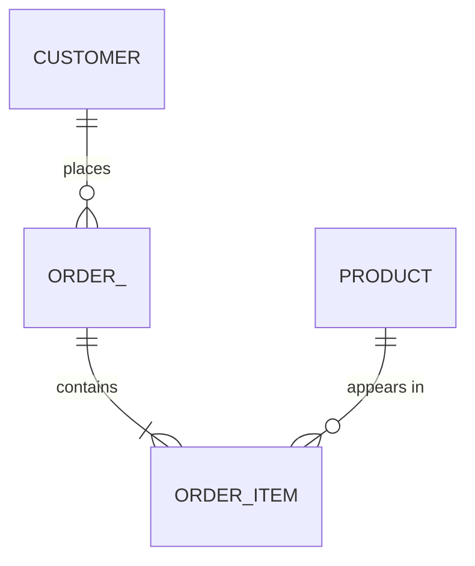
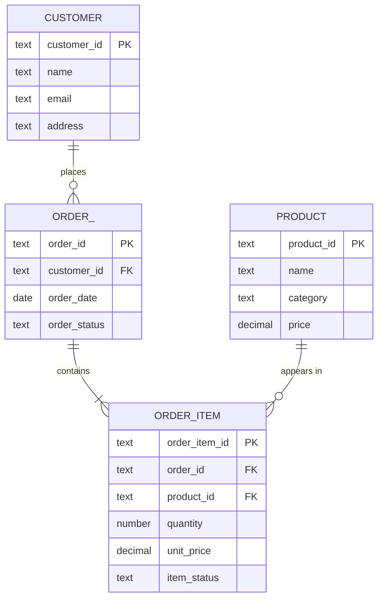
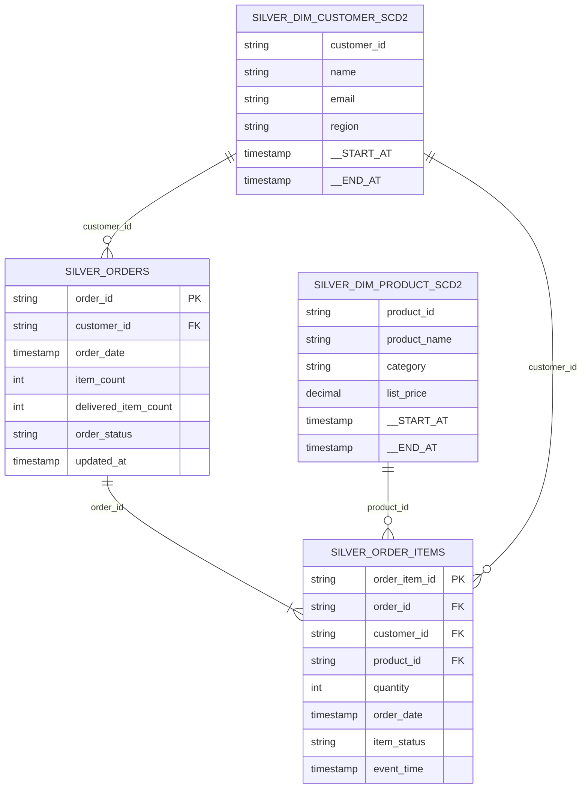
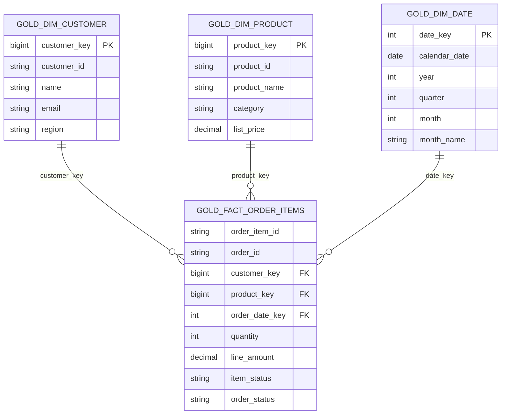

# ER Diagrams

## Conceptual Model

```mermaid
erDiagram
  CUSTOMER ||--o{ ORDER_ : places
  ORDER_ ||--|{ ORDER_ITEM : contains
  PRODUCT ||--o{ ORDER_ITEM : "appears in"
```

## Logical Model

```mermaid
erDiagram
  CUSTOMER ||--o{ ORDER_ : places
  ORDER_ ||--|{ ORDER_ITEM : contains
  PRODUCT ||--o{ ORDER_ITEM : "appears in"

  CUSTOMER {
    text customer_id PK
    text name
    text email
    text address
  }
  ORDER_ {
    text order_id PK
    text customer_id FK
    date order_date
    text order_status
  }
  ORDER_ITEM {
    text order_item_id PK
    text order_id FK
    text product_id FK
    number quantity
    decimal unit_price
    text item_status
  }
  PRODUCT {
    text product_id PK
    text name
    text category
    decimal price
  }
```

## Physical Model — Silver (Snowflake)

```mermaid
erDiagram
  SILVER_DIM_CUSTOMER_SCD2 ||--o{ SILVER_ORDERS : "customer_id"
  SILVER_ORDERS ||--|{ SILVER_ORDER_ITEMS : "order_id"
  SILVER_DIM_PRODUCT_SCD2 ||--o{ SILVER_ORDER_ITEMS : "product_id"
  SILVER_DIM_CUSTOMER_SCD2 ||--o{ SILVER_ORDER_ITEMS : "customer_id"

  SILVER_DIM_CUSTOMER_SCD2 {
    string customer_id
    string name
    string email
    string region
    timestamp __START_AT
    timestamp __END_AT
  }
  SILVER_DIM_PRODUCT_SCD2 {
    string product_id
    string product_name
    string category
    decimal list_price
    timestamp __START_AT
    timestamp __END_AT
  }
  SILVER_ORDERS {
    string order_id PK
    string customer_id FK
    timestamp order_date
    int item_count
    int delivered_item_count
    string order_status
    timestamp updated_at
  }
  SILVER_ORDER_ITEMS {
    string order_item_id PK
    string order_id FK
    string customer_id FK
    string product_id FK
    int quantity
    timestamp order_date
    string item_status
    timestamp event_time
  }
```

## Physical Model — Gold (Star Schema)

```mermaid
erDiagram
  GOLD_DIM_CUSTOMER ||--o{ GOLD_FACT_ORDER_ITEMS : "customer_key"
  GOLD_DIM_PRODUCT ||--o{ GOLD_FACT_ORDER_ITEMS : "product_key"
  GOLD_DIM_DATE ||--o{ GOLD_FACT_ORDER_ITEMS : "date_key"

  GOLD_DIM_CUSTOMER {
    bigint customer_key PK
    string customer_id
    string name
    string email
    string region
  }
  GOLD_DIM_PRODUCT {
    bigint product_key PK
    string product_id
    string product_name
    string category
    decimal list_price
  }
  GOLD_DIM_DATE {
    int date_key PK
    date calendar_date
    int year
    int quarter
    int month
    string month_name
  }
  GOLD_FACT_ORDER_ITEMS {
    string order_item_id
    string order_id
    bigint customer_key FK
    bigint product_key FK
    int order_date_key FK
    int quantity
    decimal line_amount
    string item_status
    string order_status
  }
```
