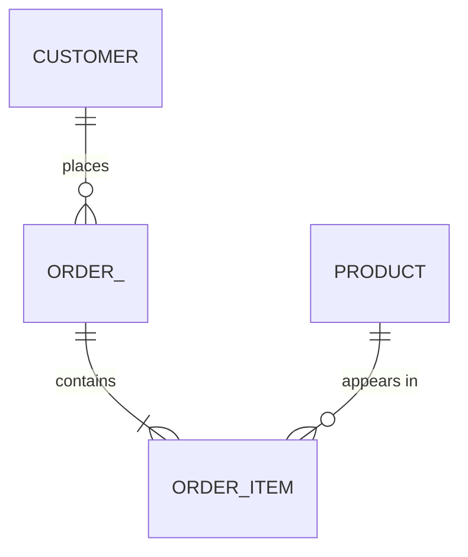
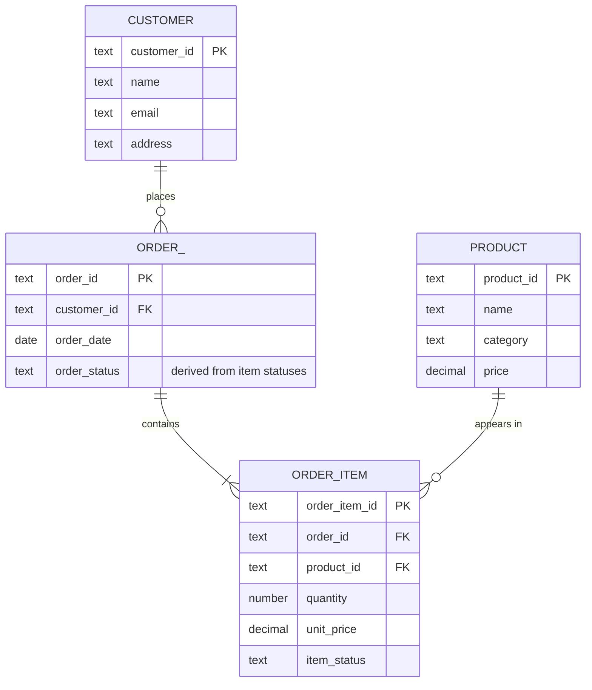
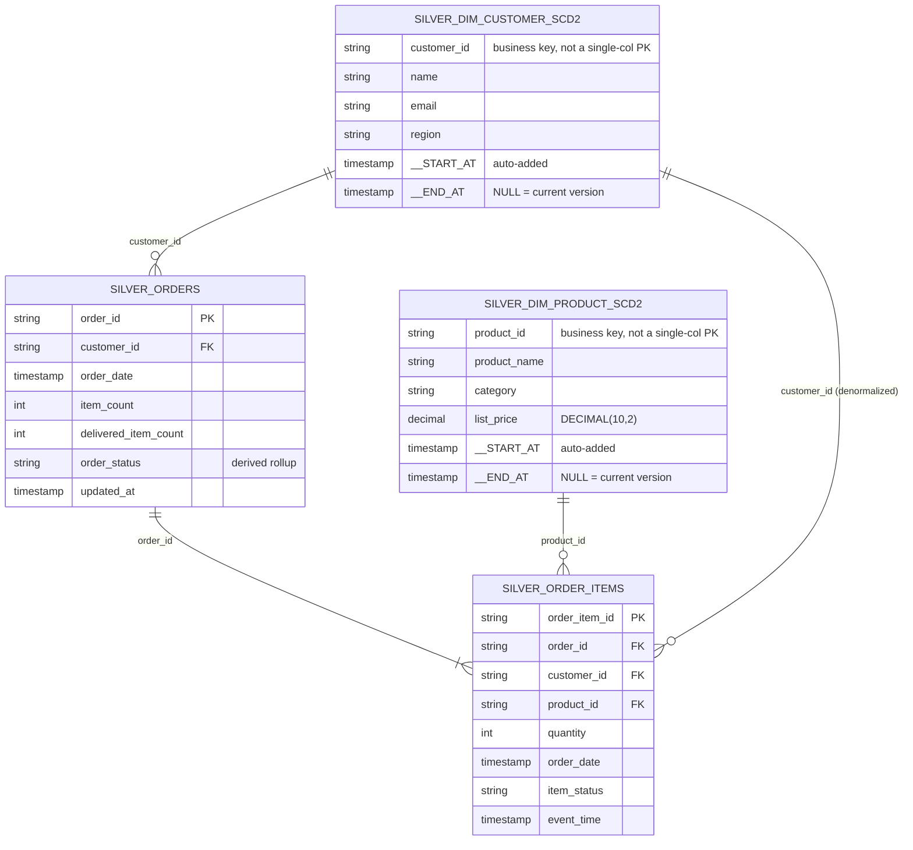
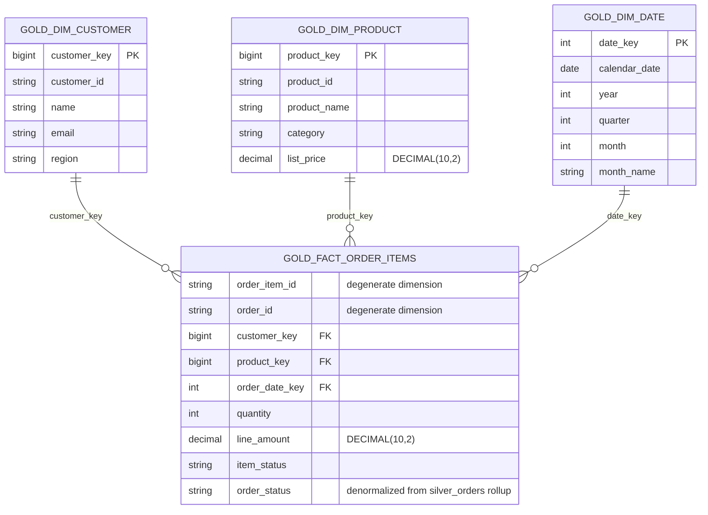
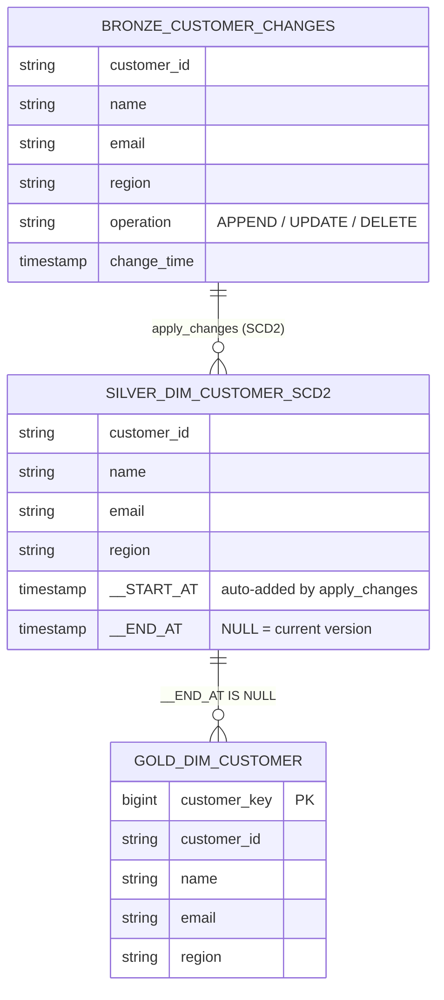

# Entity-relationship model

Three views of the same model, at increasing levels of detail — this is the
standard conceptual / logical / physical progression, not two levels:

| Tier | Shows | Doesn't show |
|---|---|---|
| **Conceptual** | Entities, relationships, cardinality | Attributes, keys, types |
| **Logical** | + every attribute, primary/foreign keys | Platform-specific types (still technology-independent) |
| **Physical** | Exact deployed table/column names and platform types | — this *is* the implementation |

## Conceptual model

Business entities and how they relate — nothing else. This is the version
to draw on a whiteboard when first framing the problem, before any
attribute or storage decision has been made.



- A **Customer** places one or more **Orders**.
- An **Order** contains one or more **Order Items**.
- A **Product** can appear in many **Order Items**.

`ORDER_` is used instead of the reserved word `ORDER` purely for
Mermaid/SQL-keyword compatibility.

## Logical model

Every attribute, every primary/foreign key — but types stay generic
(`text`, `number`, `decimal`, `date`) rather than platform-specific
(`STRING`, `DECIMAL(10,2)`, `TIMESTAMP`). This is the version that's
independent of Databricks, or of any specific database — it says what data
has to be captured and how it's keyed, not how it's physically stored.



## Physical model

The physical model is where this project's two deliberate normalization
choices show up: **silver stays snowflake-shaped** (normalized, multi-hop
joins) because its job is conformance and correctness; **gold is a star
schema** (denormalized, single-hop joins) because it's what gets queried
directly. Same underlying conceptual/logical model, two different physical
shapes, chosen per what each layer is for.

### Silver (snowflake) — as built in `src/pipeline/order_pipeline_dlt.py`

```sql
-- silver_order_items (dlt.apply_changes, stored_as_scd_type=1)
order_item_id STRING NOT NULL,  -- PK (business key)
order_id      STRING,           -- FK -> silver_orders.order_id
customer_id   STRING,           -- FK -> silver_dim_customer_scd2.customer_id
product_id    STRING,           -- FK -> silver_dim_product_scd2.product_id
quantity      INT,
order_date    TIMESTAMP,
item_status   STRING,
event_time    TIMESTAMP

-- silver_orders (batch rollup of silver_order_items)
order_id              STRING NOT NULL,  -- PK
customer_id           STRING,           -- FK -> silver_dim_customer_scd2.customer_id
order_date            TIMESTAMP,
item_count            INT,
delivered_item_count  INT,
order_status          STRING,           -- derived, never written directly
updated_at            TIMESTAMP

-- silver_dim_customer_scd2 (dlt.apply_changes, stored_as_scd_type=2)
customer_id STRING NOT NULL,  -- business key, NOT a single-column PK -- see note below
name        STRING,
email       STRING,
region      STRING,
__START_AT  TIMESTAMP,        -- auto-added by apply_changes
__END_AT    TIMESTAMP         -- auto-added by apply_changes; NULL = current version

-- silver_dim_product_scd2 (dlt.apply_changes, stored_as_scd_type=2)
product_id   STRING NOT NULL,  -- business key, not a single-column PK -- see note below
product_name STRING,
category     STRING,
list_price   DECIMAL(10,2),
__START_AT   TIMESTAMP,
__END_AT     TIMESTAMP
```

**On keys here:** `silver_order_items`/`silver_orders` have a clean
single-column PK, since one row = one current entity. The two SCD2 tables
don't — a business key repeats across every version of that entity, so the
real uniqueness constraint is the composite `(customer_id, __START_AT)` /
`(product_id, __START_AT)`, not the business key alone. Unity Catalog
`PRIMARY KEY`/`FOREIGN KEY` constraints are informational only (never
enforced on write), and declaring them cleanly on Lakeflow-managed
streaming tables adds real complexity for tables whose schema keeps
evolving as the pipeline runs. They're deliberately not implemented in this
pass; if you wanted them, the plain current-state tables
(`silver_order_items`, `silver_orders`, and the gold tables below) are the
ones where a straightforward `ALTER TABLE ... ADD CONSTRAINT` would
actually make sense.



**Why this is snowflake-shaped, concretely:** answering "which customer
placed this order item" takes two hops either way you go — `silver_order_items`
→ `silver_orders` → `silver_dim_customer_scd2` — rather than one hop to a
flat dimension, which is exactly the structural difference from gold below.

**Worth being ready to explain:** `silver_order_items` actually carries
`customer_id` directly *and* reaches the customer via `silver_orders.customer_id`
— two paths to the same dimension. That's a deliberate denormalization for
query convenience (avoids an extra join for anything that only needs
"which customer bought this item," without going through the order), not
an accidental redundancy. If a panelist points at it and asks "isn't that
inconsistent with calling this layer normalized," the honest answer is:
silver is normalized *for its core entities and rollup logic*, not
dogmatically 3NF everywhere — a single deliberately denormalized FK for a
common access pattern is a reasonable trade-off, especially since it's one
column, not a repeated attribute set.

### Gold (star schema) — dimensional model

`gold_dim_customer`/`gold_dim_product` are the **current-state projection**
of the SCD2 tables above (`__END_AT IS NULL`), which is what a star-schema
join normally wants — "who is this customer *today*." Full version history
stays queryable directly on the SCD2 tables for point-in-time analysis.



### Star vs. snowflake — why gold and silver differ on purpose

| | Star (gold) | Snowflake (silver) |
|---|---|---|
| Structure | One fact, flat dimensions, single join hop | Normalized dimensions, multiple join hops |
| Query simplicity | Fewer joins — easy for BI tools and ad hoc SQL | More joins for the same question |
| Performance | Cheap broadcast joins against small flat dimensions | More shuffle/join overhead |
| Storage | Some redundancy (e.g. category repeated per product row) | Attributes stored once |
| Update consistency | Denormalized attributes need a dimension rebuild to change | Single source of truth per attribute |
| Best fit | Serving/reporting layer, queried directly | Layer whose job is conformance/correctness |

### Design notes

- **Surrogate keys** (`customer_key`, `product_key`) are generated with
  `xxhash64(business_key)`, not `monotonically_increasing_id()`. The latter
  isn't stable across pipeline reruns — a full refresh would silently
  reassign every key and break every fact-to-dimension join. A deterministic
  hash of the business key produces the same surrogate key every time,
  across every version of that customer or product.
- **`order_id` / `order_item_id` are degenerate dimensions** — plain
  attributes on the fact row, not separate one-column dimension tables. An
  identifier with no other attributes doesn't earn its own table in
  Kimball-style design.
- **`order_status` is denormalized onto the fact table** at item grain,
  even though it's an order-level attribute. It's still derived (never set
  directly), just copied down for query convenience the way gold
  denormalizes everything else.
- `Customer 1—N Order`, `Order 1—N OrderItem`, `Product 1—N OrderItem`.

## Dimension CDC pipeline (SCD Type 2)

`src/data_generator/generate_dimension_cdc_events.py` stands in for a real
CDC connector (Debezium, a native DB CDC feed) in front of a
customer-profile service and a product catalog, emitting
`APPEND`/`UPDATE`/`DELETE` events. `src/pipeline/order_pipeline_dlt.py`
merges these with `dlt.apply_changes` — the same primitive used for
`silver_order_items`, but `stored_as_scd_type=2` instead of `1`, since
dimension state is exactly the kind of thing point-in-time reporting needs
history for.



`silver_dim_product_scd2` / `gold_dim_product` follow the identical shape.

### Why SCD2 for dimensions but SCD1 for order items

Both use `dlt.apply_changes` — the choice of `stored_as_scd_type` is about
what's actually being modeled, not a blanket rule:

| | Order items (`silver_order_items`) | Dimensions (`silver_dim_*_scd2`) |
|---|---|---|
| `stored_as_scd_type` | `1` (current state only) | `2` (full history) |
| What's being tracked | Current fulfillment status of an item | State of a customer/product *as of a point in time* |
| Why | Nothing downstream needs "what was this item's status yesterday" | "Most sold product last quarter" should reflect that quarter's price/category, not today's |

### How `apply_changes` handles each CDC operation

- **`APPEND`** (initial load) / **`UPDATE`** — both are just upserts to
  `apply_changes`; no distinct code path needed for "insert" vs. "update."
  A new version row is added with `__START_AT` = that event's
  `change_time`, and the previous version's `__END_AT` is set to match.
- **`DELETE`** — matched via `apply_as_deletes="operation = 'DELETE'"`
  (customer dimension only, in this project). This closes out the current
  version (`__END_AT` gets set) without inserting a replacement row — every
  prior version stays in the table and queryable, but there's no more
  "current" version.
- **Out-of-order events** — `sequence_by="change_time"` means a
  late-arriving event is inserted into the version history at the correct
  point rather than always being treated as "the latest," which is the
  entire reason to hand this to `apply_changes` instead of hand-rolling a
  merge.
